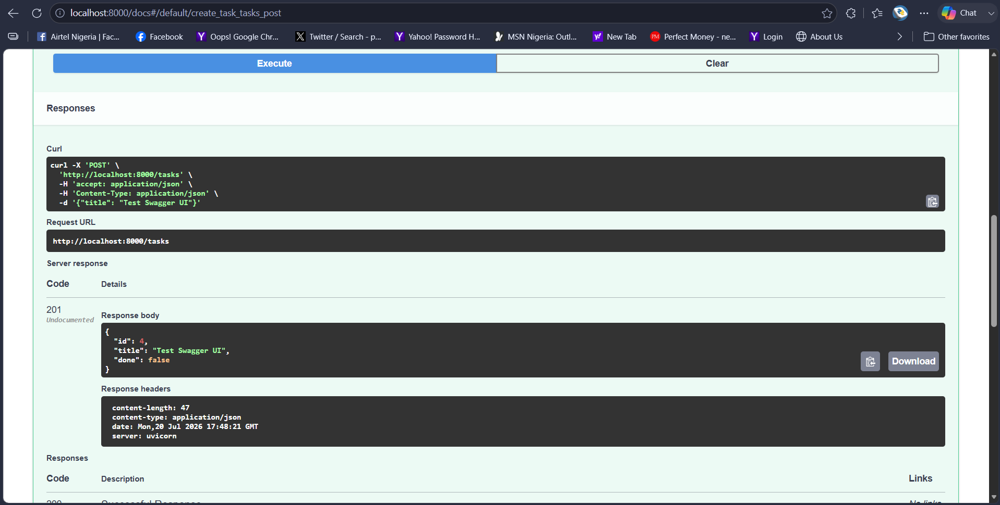
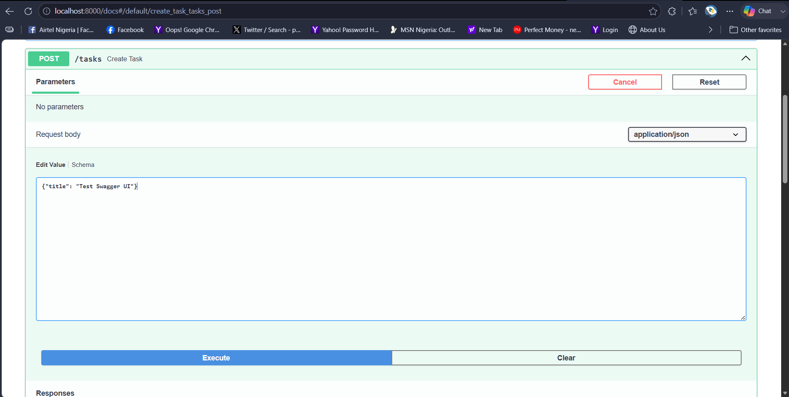

# FlyRank To-Do API

## 1. Introduction
This is a small backend API that manages a simple to-do list. Built using Python and FastAPI, it supports full CRUD operations (Create, Read, Update, and Delete) allowing users to manage tasks. The data for this API lives entirely in-memory.

## 2. How to Run It
To start the server locally, open your terminal in the project folder and run the following command:

```bash
uvicorn main:app --reload

## 3 Endpoints:
| CRUD Operation | HTTP Method | Endpoint | Meaning |
| :--- | :--- | :--- | :--- |
| **Read** | `GET` | `/` | Returns the API description and version info. |
| **Read** | `GET` | `/health` | Returns a simple status check to ensure the server is alive[cite: 1]. |
| **Create** | `POST` | `/tasks` | Add a new task[cite: 1]. |
| **Read** | `GET` | `/tasks` | List all tasks[cite: 1]. |
| **Read** | `GET` | `/tasks/{id}` | Get a specific task by its ID[cite: 1]. |
| **Update** | `PUT` | `/tasks/{id}` | Change a specific task's details[cite: 1]. |
| **Delete** | `DELETE` | `/tasks/{id}` | Remove a task from the list[cite: 1]. |

## 4. Example Request
Here is the output of fetching the task list via curl:

HTTP/1.1 200 OK
date: Mon, 20 Jul 2026 18:06:58 GMT
server: uvicorn
content-length: 131
content-type: application/json

## 5. Swagger UI Testing
Here are the results from testing the endpoints directly in the UI:


